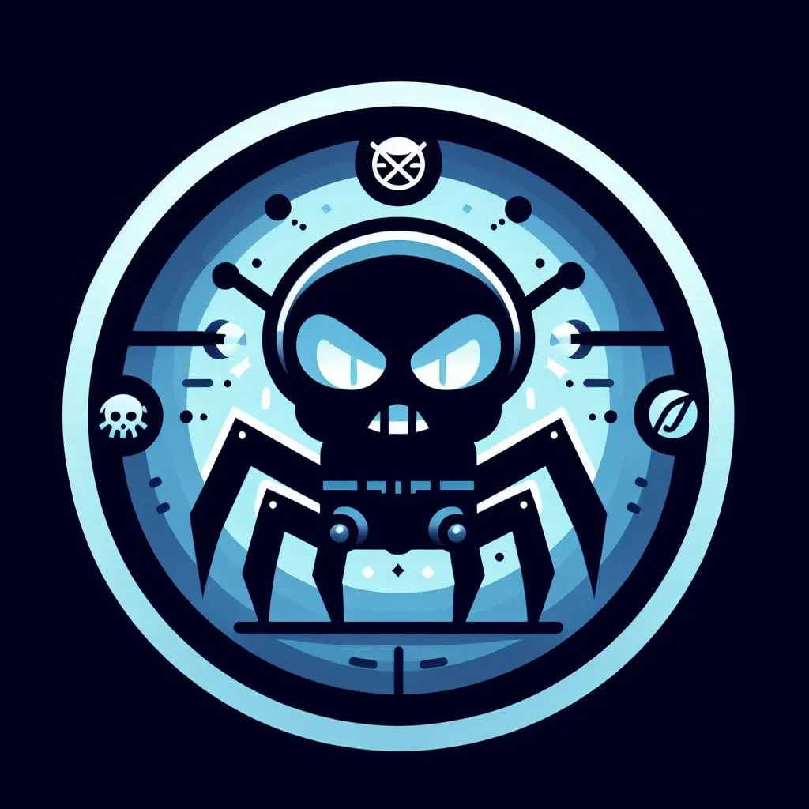

<p align="center">
    </img>
</p>

<h1 align="center" style="font-weight: bold;">Pest-Annihilator No.1588</h1>

<p align="center">
  
  
  
</p>

## Description

- A mobile app that detect pests and destroy them.
- This app is powered by expo and react-native.

## Features

- Detect pests using [roboflow's](https://universe.roboflow.com/) api.
- Destroy pests, we will (probably) made a custom arduino based robot to destroy pests soon.
- comming soon...

## Installation

```bash
npm i
npx expo start
```


